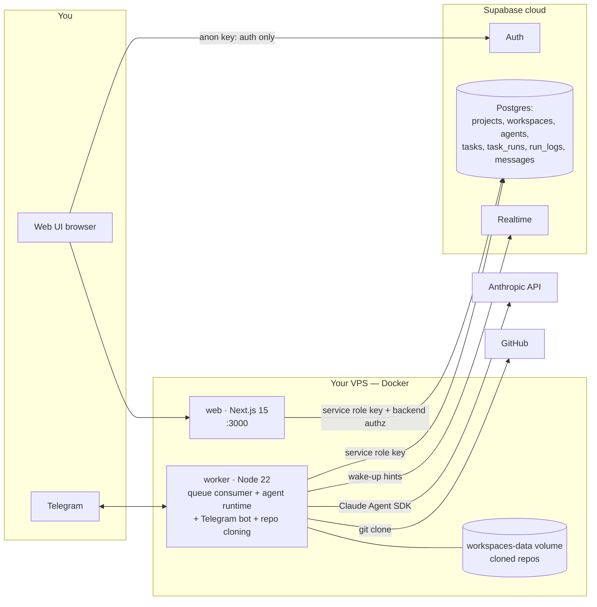

# Agent Fleet

Self-hosted platform for running a fleet of Claude agents against your own
repositories. You create **projects**; each project contains **workspaces**
(folders of cloned GitHub repos — multi-repo, pinned to a single branch each)
and **agents** (Claude Agent SDK runtimes) that pick work off a Postgres-backed
**task queue**. A **Manager**, a **Project Manager**, and a **Librarian** are
created with every project: you talk to the manager from the web UI or
Telegram, and it decomposes your request into tasks for specialist agents. Everything an agent does — every tool call, every message —
is logged to `run_logs`, so a full audit trail of every run is one query away.

**Stack:** Next.js 15 (web UI) · Node 22 worker service · Supabase
(Auth + Postgres + Realtime) · Docker on any Linux VPS.

## Architecture



How work flows: a task is inserted with `status = 'queued'` (by the web API,
the Telegram bot, or a manager agent). The worker claims it atomically via the
`claim_next_task` RPC (`FOR UPDATE SKIP LOCKED` — multiple workers are safe),
records a `task_runs` row, executes the agent with the Claude Agent SDK
(cwd set to the agent's workspace when it has one), streams every SDK event
into `run_logs`, and finally marks the task `done` or `failed` with its
`result`. The web UI keeps task boards, chat, and log streams fresh by
polling its own API routes (Realtime is only used by the worker, as a
wake-up hint).

See [ARCHITECTURE.md](ARCHITECTURE.md) for the full domain model, and
[docs/CREATING-AGENTS.md](docs/CREATING-AGENTS.md) for how to write good
agents.

## Guides

- **Communication agents (Slack & Gmail)** —
  [docs/COMMS-AGENTS.md](docs/COMMS-AGENTS.md): triage agents that read your
  Slack/Gmail via MCP, draft replies in your voice, and propose every
  outbound message for your approval before anything is sent.
- **Project management agents (Notion)** —
  [docs/PROJECT-MANAGEMENT-AGENTS.md](docs/PROJECT-MANAGEMENT-AGENTS.md):
  every project is created with a Project Manager agent that reads your
  team's Notion tasks board, sends a morning digest (web + Telegram), and
  keeps your roadmap page organized with you in chat — plus a Librarian
  agent that curates everything the fleet knows. The guide covers what you
  still have to supply: the Notion integration, the schedules and the
  grounding knowledge docs.

## Repository layout

```
agent-fleet/
├── apps/
│   ├── web/       # Next.js 15 app: auth, project/workspace/agent CRUD, chat, task board, log viewer
│   └── worker/    # Node service: queue consumer, agent runtime, Telegram bot, repo cloning
├── packages/
│   └── shared/    # @agent-fleet/shared — DB row types, zod schemas, constants
├── supabase/      # config.toml + SQL migrations
├── infra/         # Dockerfiles for web and worker
├── docs/          # deployment + agent-authoring guides
└── docker-compose.yml
```

## Prerequisites

- **Node.js 22** and **pnpm 9.15** (`corepack enable` gives you the pinned
  version automatically) — for local development
- **Docker + Docker Compose v2** — for production deploys
- A **Supabase** account (free tier works)
- An **Anthropic API key** ([console.anthropic.com](https://console.anthropic.com))
- Optional: a **Telegram bot token** (chat with your fleet from your phone)
- Optional: a **GitHub personal access token** (clone private repos)

## Setup

### 1. Create a Supabase project

Create a new project at [supabase.com](https://supabase.com). Any region,
any plan.

### 2. Apply the database migrations

Apply **all** migrations in `supabase/migrations/`, in filename order:

- `0001_init.sql` — core tables, the `claim_next_task` RPC, triggers,
  Realtime publication.
- `0002_backend_authz.sql` — moves authorization to the backend: disables
  RLS, drops all policies, and revokes all table/function privileges from
  the `anon`/`authenticated` roles (the browser can no longer query the
  database directly; all data access goes through the web app's API routes).
- `0003_automations.sql` — schedules, approval-gated pending actions,
  agent knowledge docs, per-project integrations.
- `0004_cost_tracking.sql` — token/cost columns on `task_runs`.
- `0005_pm_librarian.sql` — daily schedules, per-agent chat threads,
  project-scoped knowledge with provenance, the librarian role.

**Option A — Supabase CLI (recommended):**

```bash
npx supabase login
npx supabase link --project-ref <your-project-ref>
npx supabase db push
```

**Option B — SQL editor:** open your project's *SQL Editor* in the Supabase
dashboard and run each migration file's contents, one at a time, in
filename order (`0001` → `0005`).

### 3. Get your Supabase keys

In the Supabase dashboard: **Project Settings → API Keys**. You need three
values. Supabase now issues `sb_publishable_...` / `sb_secret_...` keys (the
legacy `anon` / `service_role` JWT keys are deprecated but still accepted —
the env var names are kept for compatibility):

| Value | Goes into |
|---|---|
| Project URL | `NEXT_PUBLIC_SUPABASE_URL` |
| Publishable key (`sb_publishable_...`, legacy `anon`) | `NEXT_PUBLIC_SUPABASE_ANON_KEY` (browser — auth only) |
| Secret key (`sb_secret_...`, create one; legacy `service_role`) | `SUPABASE_SERVICE_ROLE_KEY` (web server + worker — never in the browser) |

### 4. (Optional) Create a Telegram bot

Message [@BotFather](https://t.me/BotFather) on Telegram, send `/newbot`,
follow the prompts, and copy the token it gives you into
`TELEGRAM_BOT_TOKEN`. Skip this entirely if you only want the web UI.

### 5. Fill in `.env`

```bash
cp .env.example .env
```

Then edit `.env` — each variable is documented inline. `TELEGRAM_BOT_TOKEN`
and `GITHUB_TOKEN` are optional; leave them empty to disable Telegram / use
public repos only.

### 6. Local development

```bash
corepack enable        # once per machine — activates pinned pnpm
pnpm install
pnpm dev               # turbo runs web (http://localhost:3000) + worker together
```

Sign up through the web UI (Supabase Auth creates your profile row via
trigger), create a project, and you're off.

### 7. Production deploy (VPS)

On any Linux VPS with Docker installed:

```bash
git clone <your-fork-or-repo-url> agent-fleet
cd agent-fleet
cp .env.example .env && nano .env   # fill in real values
docker compose up -d --build
```

The web UI is on port 3000; the worker has no exposed ports. Cloned repos
persist in the `workspaces-data` named volume. See
[docs/DEPLOYMENT.md](docs/DEPLOYMENT.md) for the full VPS guide (Docker
install, updates, logs, backups, HTTPS reverse proxy).

## Linking Telegram

1. In the web UI, open **/settings** — it shows a one-time link code for your
   account (stored on your profile as `telegram_link_code`).
2. Open a chat with your bot on Telegram and send `/link CODE`.
3. The worker verifies the code and stores your `telegram_chat_id` on your
   profile. From then on, messages you send the bot are routed to the manager
   agent of your project, and manager replies come back over Telegram.

## Security notes

- **Backend authorization, not RLS.** Migration `0002_backend_authz.sql`
  disabled RLS and revoked all table access from the `anon`/`authenticated`
  roles. The browser's `anon` key is used **only for auth** (signup, login,
  session, sign-out) — it cannot read or write any table. All data access
  goes through the web app's API routes, which authenticate the session
  cookie and enforce `projects.owner_id` ownership in application code.
- **Key separation.** The `service_role` key is used by the **web app's
  server** (API routes / server components) and the **worker** — keep it out
  of anything client-side and out of git. It is never sent to the browser
  (the web admin client is guarded with the `server-only` package).
- **Agents run with bypassed permissions.** Inside the worker container,
  Claude Agent SDK sessions run without interactive permission prompts — an
  agent can run shell commands, edit files, and hit the network from inside
  its workspace. Treat the VPS as a **trusted execution environment**: don't
  share it with unrelated services, and only give agents instructions and
  repos you're comfortable with.
- **Consider restricting egress later.** A follow-up hardening step is to
  firewall the worker container's outbound traffic (e.g. allow only
  Anthropic, Supabase, GitHub, and Telegram) so a misbehaving agent can't
  exfiltrate anywhere else.
- The `workspaces-data` volume may contain checkouts of your **private
  repos** — it inherits the sensitivity of whatever you clone into it.

## Known caveats

- **Commit `pnpm-lock.yaml`.** The Dockerfiles prefer
  `pnpm install --frozen-lockfile` and fall back to a plain (non-reproducible)
  install with a warning if the lockfile is missing. Run `pnpm install` once
  locally and commit the lockfile before building images.
- **The worker runs through `tsx`, not compiled output.** `@agent-fleet/shared`
  ships raw TypeScript (its `main` points at `src/index.ts`), so plain
  `node dist/index.js` cannot resolve it at runtime. The worker's `start`
  script is therefore `tsx src/index.ts` (`tsx` is a production dependency),
  and the worker image runs the same way over source. The worker's `build`
  script (tsc) is kept purely as a compile/typecheck gate — its `dist/` is
  not what runs in production.
- **`NEXT_PUBLIC_*` are build-time values.** They're baked into the web
  bundle by `docker compose build`. If you change them in `.env`, rebuild the
  web image (`docker compose up -d --build web`) — restarting is not enough.
